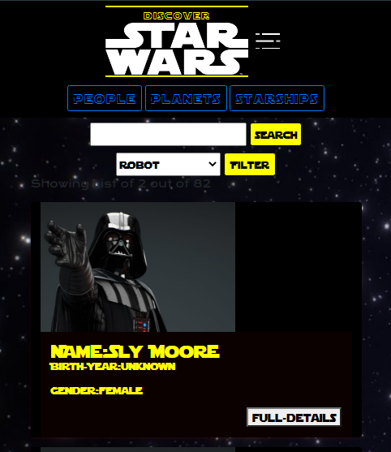
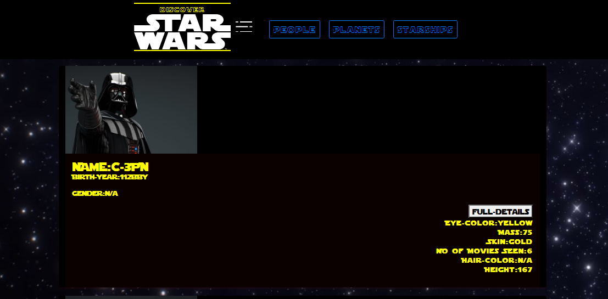
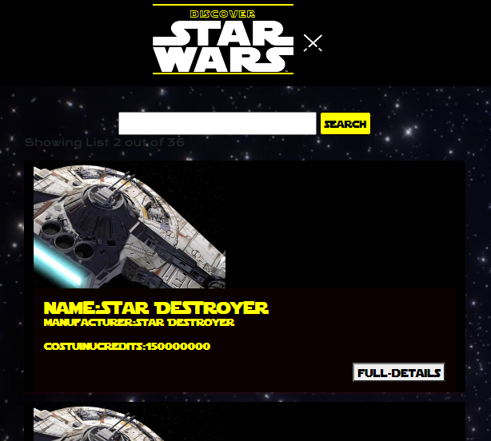
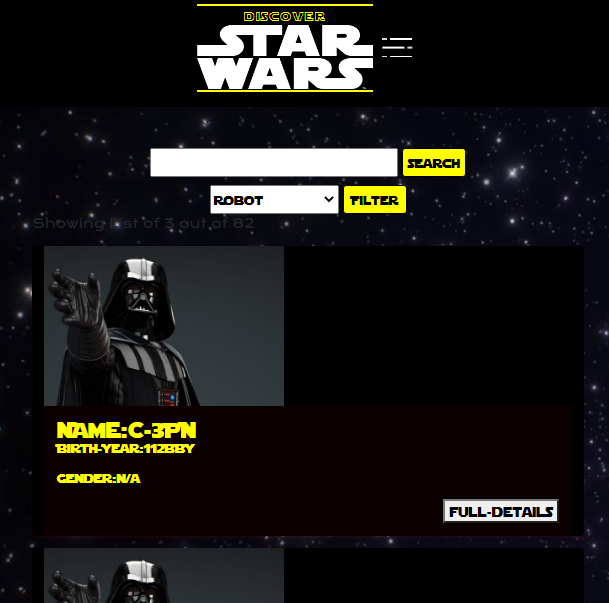

## Discover StarWars

A simple React App That lets you view details of the various characters,planets and starships  in the starwars galaxy using 
[SWAPI](https://swapi.dev/api/)

###Site Layout
app uses bootstrap and some custom css for layout

##Functionalities 
- User can view a list of people (humans & robots), list item contains full name, birth year and gender
- User can view a list of planets, list item contains name, temperature and population.
- User can view a list of starships, list item contains name, model and cargo capacity.
- User can see full details of selected person, planet or starship by clicking on the full-details button
- For each listing, user can search using name to filter the list.
- User can filter based on gender in the people section (male, female, robot and Hemaphrodites)
- Data from the API is diplayed with pagination and user can go between listings using the previous and next buttons 
- fairly ok design
- few animations and micro interactions 

 run app locally by cloning the repo and running 

## `cd` Into the project directory, and then 

### `npm install`

### `npm start`

Open [http://localhost:3000](http://localhost:3000) to view it in the browser.

or view hosted version [Here](https://kuzzzzz.github.io/discover-starwars/)

##screen shoots

Main page Mobile view: 

Main page Desktop view: 

search Result View: 

Filter Result View: 